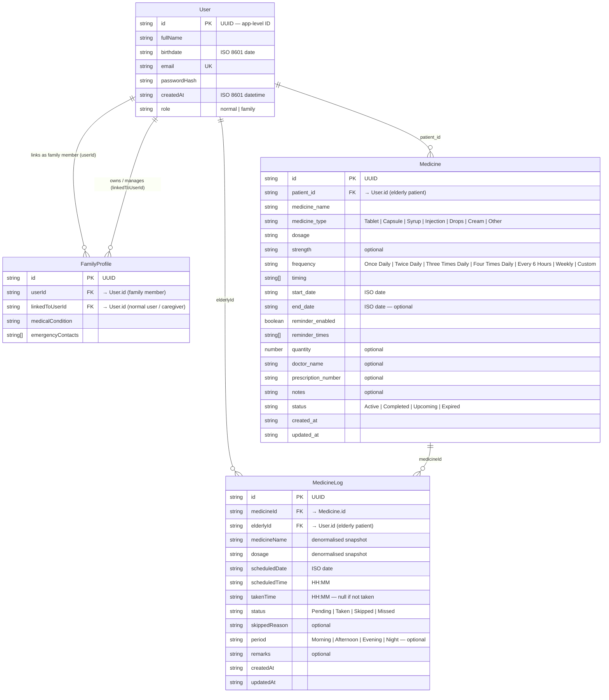

# Database Schema — Elderly Care App

MongoDB / Mongoose · 4 Collections

---

## Entity Relationship Diagram

---

## Collections at a Glance

| Collection | MongoDB Name | Primary Key | Key Indexes |
|---|---|---|---|
| User | `users` | `id` (UUID) | `id`, `email` |
| FamilyProfile | `familyprofiles` | `id` (UUID) | `id`, `userId`, `linkedToUserId` |
| Medicine | `medicines` | `id` (UUID) | `id`, `patient_id` |
| MedicineLog | `medicinelogs` | `id` (UUID) | `id`, `medicineId`, `elderlyId`, `scheduledDate` |

---

## Collection Details

### `users`

| Field | Type | Constraints |
|---|---|---|
| `id` | String | required, unique, indexed |
| `fullName` | String | required |
| `birthdate` | String | required (ISO date) |
| `email` | String | required, unique, indexed |
| `passwordHash` | String | required |
| `createdAt` | String | required (ISO datetime) |
| `role` | String | enum `normal` \| `family`, default `normal` |

---

### `familyprofiles`

| Field | Type | Constraints |
|---|---|---|
| `id` | String | required, unique, indexed |
| `userId` | String | required, indexed → `User.id` |
| `linkedToUserId` | String | required, indexed → `User.id` |
| `medicalCondition` | String | required |
| `emergencyContacts` | String[] | default `[]` |

---

### `medicines`

| Field | Type | Constraints |
|---|---|---|
| `id` | String | required, unique, indexed |
| `patient_id` | String | required, indexed → `User.id` |
| `medicine_name` | String | required |
| `medicine_type` | String | required, enum `Tablet \| Capsule \| Syrup \| Injection \| Drops \| Cream \| Other` |
| `dosage` | String | required |
| `strength` | String | optional |
| `frequency` | String | required, enum (7 values) |
| `timing` | String[] | required, default `[]` |
| `start_date` | String | required (ISO date) |
| `end_date` | String | optional |
| `reminder_enabled` | Boolean | required, default `false` |
| `reminder_times` | String[] | required, default `[]` |
| `quantity` | Number | optional |
| `doctor_name` | String | optional |
| `prescription_number` | String | optional |
| `notes` | String | optional |
| `status` | String | required, enum `Active \| Completed \| Upcoming \| Expired` |
| `created_at` | String | required |
| `updated_at` | String | required |

---

### `medicinelogs`

| Field | Type | Constraints |
|---|---|---|
| `id` | String | required, unique, indexed |
| `medicineId` | String | required, indexed → `Medicine.id` |
| `elderlyId` | String | required, indexed → `User.id` |
| `medicineName` | String | required (denormalised) |
| `dosage` | String | required (denormalised) |
| `scheduledDate` | String | required, indexed (ISO date) |
| `scheduledTime` | String | required (HH:MM) |
| `takenTime` | String \| null | default `null` |
| `status` | String | required, enum `Pending \| Taken \| Skipped \| Missed`, default `Pending` |
| `skippedReason` | String | optional |
| `period` | String | optional, enum `Morning \| Afternoon \| Evening \| Night` |
| `remarks` | String | optional |
| `createdAt` | String | required |
| `updatedAt` | String | required |

---

## Key Design Notes

> [!NOTE]
> **UUID Strategy**: All collections use app-generated UUID strings as the primary `id` field, stored alongside Mongoose's native `_id`. This decouples domain IDs from MongoDB ObjectIDs.

> [!NOTE]
> **Denormalisation in MedicineLog**: `medicineName` and `dosage` are stored redundantly in each log entry so the historical record remains accurate even if the medicine is updated or deleted.

> [!NOTE]
> **No Mongoose `timestamps`**: `createdAt` / `updatedAt` are managed by the service layer, not by Mongoose's built-in `timestamps: true`. This gives the app full control over the format and timezone.

> [!TIP]
> **Compound index suggestion**: A compound index on `{ elderlyId, scheduledDate }` in `medicinelogs` would speed up the daily report queries significantly.
